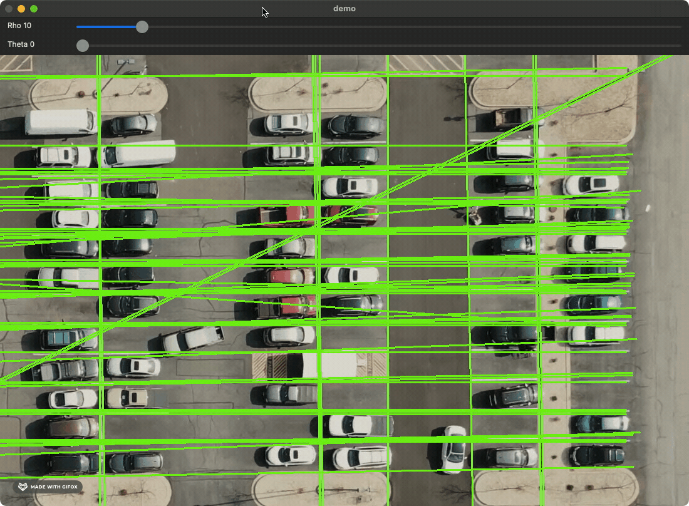

# Mask Generator
A Python-based adaptable mask generator implemented using the Canny edge detection algorithm and Hough Line Transform, offering flexibility in capturing and highlighting intricate details within images.

The generated mask can be used as a filter for identifying Points of Interest (POI) in object detection.

## Prerequisites
- Ensure Python 3.9 environment is installed
- Prepare the image that will be used for generating the mask and update [the filename](src/main.py#L115) accordingly

## Installation
1. Clone the project and change directory to the project.
    ```bash
    git clone https://github.com/adelinewei/mask-generator.git
    cd mask-generator
    ```
2. Create a Python virtual enviornment.
    ```bash
    python3 -m venv .venv
    ```
3. Activate created Python virtual environment.
    ```bash
    source .venv/bin/activate
    ```
4. Install dependencies.
    ```bash
    make install
    ```

## Usage
Open the mask generator.
```bash
make start
```
Modify the rho and theta thresholds to adjust the merging of lines by changing the values on the tracebar.


Remove an unwanted line by right-clicking.


Press `m` to generate a mask based on the current settings. The generated mask will be saved in the `output` directory as an image file. The default extension for the file is jpg.


Press `q` to quit the mask generator.

## Implementation Details
For learning purpose, I listed down the thoughts of building this application step by step.

1. Apply image blurring techniques for enhanced preprocessing.
2. Utilize the Canny edge detection algorithm for accurate edge identification.
3. Utilize the Hough Line Transform algorithm to detect lines in the image.
4. Combine lines with similar characteristics to reduce redundancy.
5. Implement adjustable trackbars to fine-tune threshold values for line merging.
6. Allow users to remove unwanted lines by right-clicking.
7. Implement the feature to generate masks by applying identified lines.
8. Save the processed image as a .jpg file.

## Project Status
In progress.

Todos in the roadmap include:
- Integrate additional trackbars for dynamic threshold adjustments in Canny and Hough Line Transform algorithms
- Implement line-drawing functionality
- Implement block coloring functionality